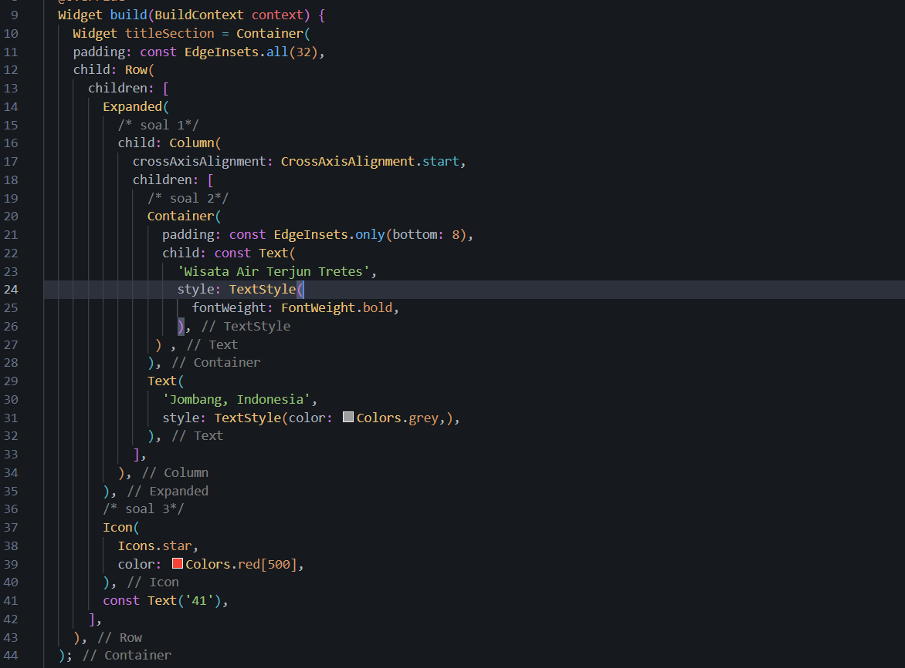
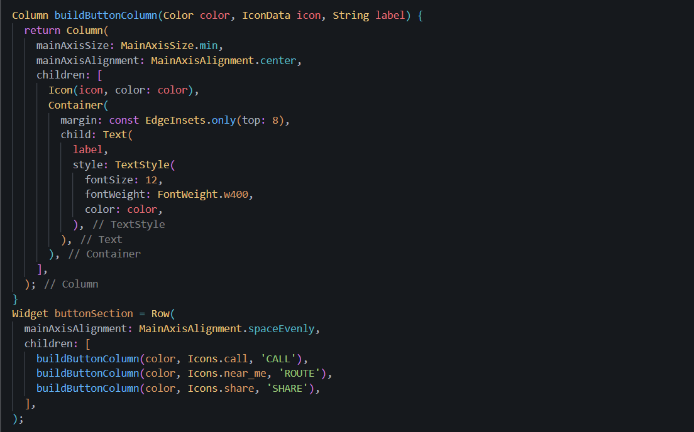
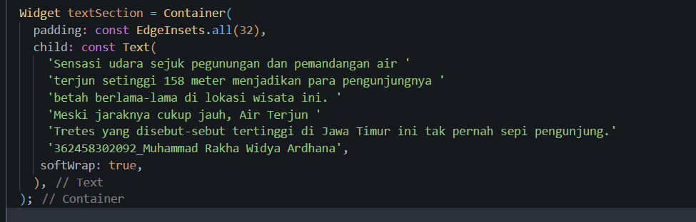
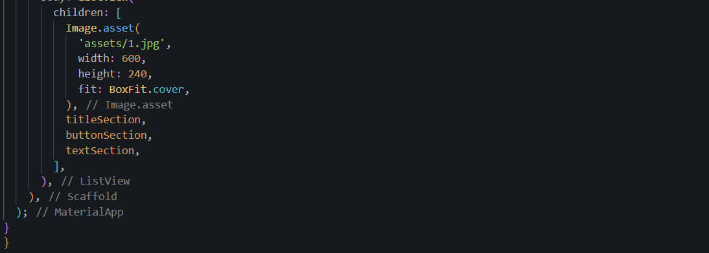

# layout_flutter

A new Flutter project.

## Getting Started

langkah pertama kita dapat membuat project baru, disini saya membuat dengan cara ctrl shift p untuk membuatnya, lalu buat layout pada flutter dengan cara seperti pada gambar

selanjutnya kita membuat column button yang berisi 3 kolom untuk tombol, lalu buat fungsi untuk menambahkan ikon lalu tambahkan buttonsection kebody

selanjutnya tambahkan teks untuk deskripsi dari wisata yang akan dibuat dengan menambahkan variabel text section kebody

implementasikan gambar yang telah disiapkan sebelumnya, siapkan folder img dan tambahkan gambar kesana lalu import ke file main.dart

ini adalah hasil akhir untuk praktikum ini